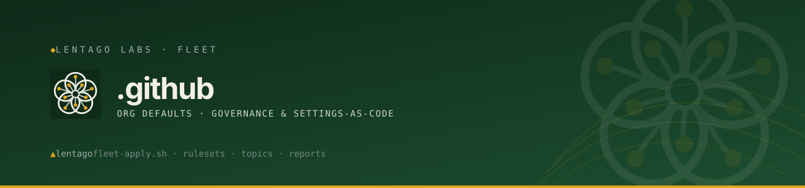

<!-- Lentago Labs brand header — generated by lentago/.github → brand/generate.py.
     Regenerate there; do not hand-edit the banner or badge URLs. -->

  

  

# .github — Lentago Labs org defaults and fleet governance

This is the Lentago Labs organization's special `.github` repository. It serves
two roles: GitHub reads org-level defaults from here, and it houses the
settings-as-code tooling that governs the rest of the fleet.

## Org profile

[`profile/README.md`](profile/README.md) renders as the organization profile page
at **[github.com/lentago](https://github.com/lentago)**.
[`profile/assets/banner.svg`](profile/assets/banner.svg) is its header.

## Community-health defaults

`CONTRIBUTING.md`, `SECURITY.md`, `CODE_OF_CONDUCT.md`, and `LICENSE` live at the
repo root and apply org-wide to any Lentago Labs repo that doesn't define its own.
Issue and PR templates are not yet set.

## Fleet governance

### [`terraform/`](terraform/)

The fleet's GitHub settings as Terraform, via the `integrations/github` provider.
Owns repository **existence** and identity, merge-button options, the topic
spine, the per-repo `main` branch ruleset, required status checks, and the
Tidewater label palette — across every repo in the org.

Adding a repo to [`fleet-ops/repos.json`](fleet-ops/repos.json) and applying
creates it, scaffolded from `repo-template` and wired to fleet policy from its
first second. Removing one is refused by `prevent_destroy` rather than deleting
a live repository. Applies are operator-run today; apply-on-merge is phase 2.
See [`terraform/README.md`](terraform/README.md).

### [`fleet-ops/`](fleet-ops/)

The configuration Terraform reads, plus the imperative sweeps that have no
declarative equivalent.

- **`repos.json`** — per-repo identity: description, homepage, visibility,
  features, signature topics, model-routing labels. The source of truth for
  which repos the fleet contains.
- **`required-checks.json`** — per-repo map of the status checks that must pass
  before merge.
- **`labels.json`** — the Tidewater issue-label palette. Colors and descriptions
  for the labels it names; per-repo labels it doesn't name are left alone.
- **`fleet-apply.sh`** — the pre-Terraform drift checker, still the tool for the
  two jobs Terraform can't express: `--prune-branches` (merged-branch residue)
  and the preflight that a required check-run context actually reports before
  anything requires it. Its settings-applying flags are superseded by
  `terraform/`.
- **`repo-ruleset.json`** — the branch-ruleset template `fleet-apply.sh` used;
  the same shape now lives in `terraform/rulesets.tf`.
- **`org-ruleset.json`** — org-level ruleset definition, parked (needs a paid
  plan).

### [`fleet-reports/`](fleet-reports/)

Periodically regenerated reports published in this repo.

- **`fleet-report.md`** — the weekly fleet report: open issues by repo, a 30-day
  merge/close activity snapshot, and an instruction-as-code language census. Auto-
  refreshed every Monday by a GitHub Actions workflow.
- **`incidents.md`** — the public incident register, linking to post-mortems under
  `fleet-reports/incidents/`. New reports are harvested from session transcripts
  via the local `/incident-digest` playbook.

### [`metrics/`](metrics/)

- **`generate-fleet-reports.py`** — generates both `fleet-report.md` and
  `incidents.md`.
- **`language-census.md`** — a periodic `cloc`-based language breakdown across
  all in-scope org repos.

### [`ci/`](ci/)

- **`validate.py`** — the check that gates PRs here. Asserts that `fleet-ops/*.json`
  match the shape `fleet-apply.sh` and the Terraform module consume, that those
  manifests and `brand/fleet.json` agree on which repos exist, that
  `brand/generated/` is reproducible
  from `brand/fleet.json` rather than hand-edited, that the report generator's
  classifiers route known paths correctly, and that
  `fleet-reports/incidents.md` is reproducible from its sources rather than
  hand-edited. Run it the way CI does: `python3 ci/validate.py`.

### [`brand/`](brand/)

Brand assets, and the generator that turns them into per-repo identity.

- **`avatars/`** — the Lentago Labs mark in SVG and PNG variants (square and
  circular, teal and limestone colourways).
- **`marks/`** — the 64-grid genus marks, one per fleet system, plus the
  lentago blossom that every other repo falls back to.
- **`fleet.json` + `generate.py`** — per-repo identity as config: emits each
  repo's README banner, badge row, and 1280×640 social-preview card into
  `brand/generated/`. `render.sh` rasterizes the cards with the real brand
  typefaces. Generated output is CI-enforced against hand-editing.

Social previews are the one surface with no API — they're uploaded per repo
under **Settings → General → Social preview**.

---

> Fleet CI *conventions* and the reusable workflows other repos call live in
> [shared-workflows](https://github.com/lentago/shared-workflows), not here. The
> workflows under `.github/workflows/` are this repo's own — they gate its PRs and
> refresh the fleet reports.

---

*Built in collaboration with [Claude](https://claude.ai) (Anthropic) — directed and reviewed by an infrastructure operator, not a software engineer.*
