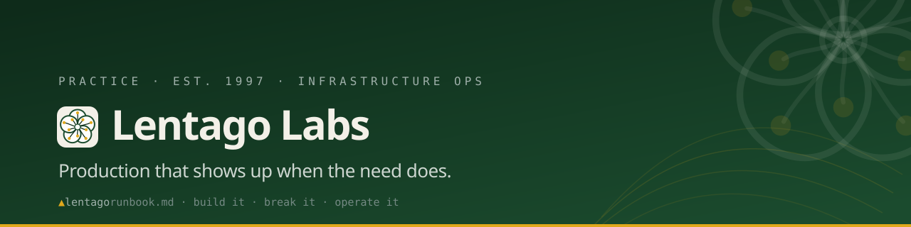
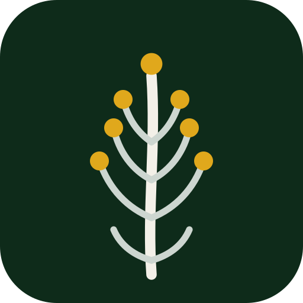
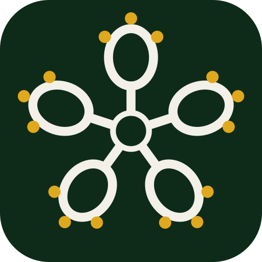
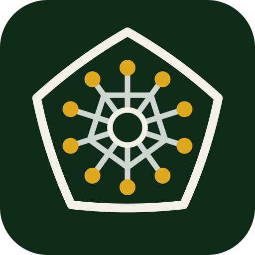
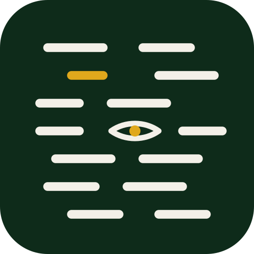

**Keeping production up — bare metal through cloud-native, and every platform shift in between. We build it, break it, and operate it.**

📖 &nbsp;The full runbook lives at **[lentago.dev](https://lentago.dev)** →

 

### ☁️ &nbsp; Cloud & containers

### 🖥️ &nbsp; Bare metal & virtualization

### 🏗️ &nbsp; Infrastructure as code

### 🔁 &nbsp; CI/CD & supply chain

### 📟 &nbsp; Observability & on-call

 

| What we do | |
| :-- | :-- |
| **Platform engineering** | Greenfield builds, Terraform-managed, observable from day one. |
| **Cost & posture audits** | One-page report, no theatre. |
| **Incident & on-call** | Runbooks and rotations humans can actually live with. |
| **CI/CD & supply chain** | OIDC, plan-on-PR, no long-lived credentials. |
| **AI-augmented delivery** | A Claude agent fleet that builds and reviews — directed by humans, who own every merge. |

 

### 🌿 &nbsp; The suite

Each system splits a platform-agnostic core from per-source clients — the current build is always <i>the first client</i>, never the product.

<table>
<tr>
<td>&nbsp; <a href="https://github.com/lentago/solidago"><b>solidago</b></a></td>
<td>Reference three-tier AWS platform — 100% Terraform: VPC, ECS Fargate, RDS, WAF.</td>
</tr>
<tr>
<td>&nbsp; <a href="https://github.com/lentago/drosera"><b>drosera</b></a></td>
<td>Git-driven observability into Grafana Cloud — one Alloy container, Terraform-provisioned dashboards.</td>
</tr>
<tr>
<td>&nbsp; <a href="https://github.com/lentago/kalmia"><b>kalmia</b></a></td>
<td>Idempotent provisioning for workstations, VMs, and containers.</td>
</tr>
<tr>
<td>&nbsp; <a href="https://github.com/lentago/claytonia"><b>claytonia</b></a></td>
<td>Self-hosted agent fleet — drop a job, get a reviewed PR back.</td>
</tr>
<tr>
<td>&nbsp; <a href="https://github.com/lentago/betula"><b>betula</b></a></td>
<td>Full-volume log capture &amp; archive → Axiom, at zero query cost.</td>
</tr>
</table>

### 📊 &nbsp; Fleet in numbers

Regenerated weekly from the repos themselves — we operate in the open.

- **[Fleet report](https://github.com/lentago/.github/blob/main/fleet-reports/fleet-report.md)** — open issues by repo, a 7-day activity snapshot, and a code census that counts the `CLAUDE.md`-family instruction files as natural-language code.
- **[Language census](https://github.com/lentago/.github/blob/main/metrics/language-census.md)** — the canonical all-languages breakdown.

<b>chris@lentago.dev</b> &nbsp;·&nbsp; New England, US &nbsp;·&nbsp; remote · async-friendly

