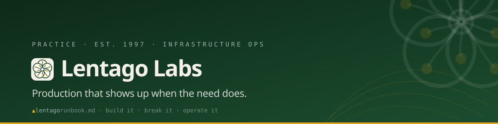
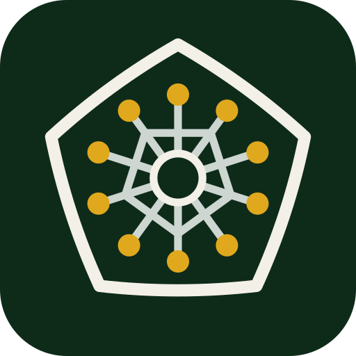
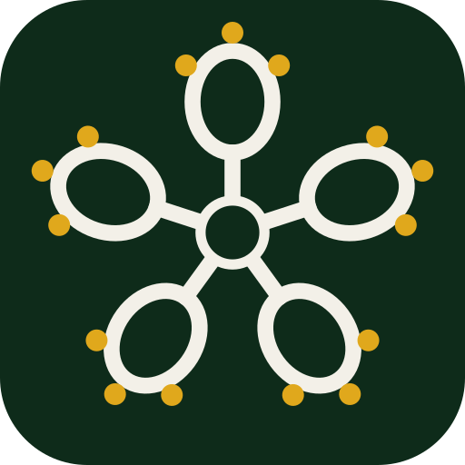
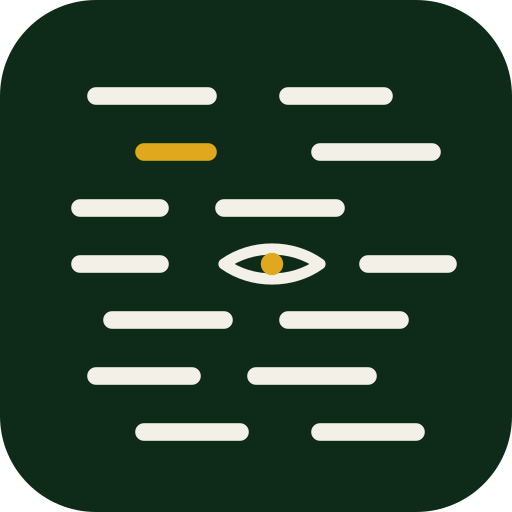
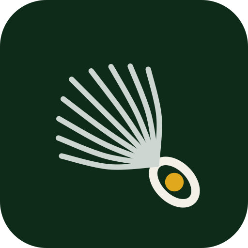

**Lentago Labs is a pro-bono operations practice for organizations that run on volunteers, donations, and one overworked tech person** — the nonprofit with one tech director, the all-volunteer org with one person who does the computers, the single technician covering a whole shop alone.

Most mission-driven teams rent their systems: donated software seats and free vendor tiers they don't own and can't leave. We help you move to infrastructure you own outright — the same free tiers, in your own accounts, set up as code you can copy, run by people we've shown how. Everything here is free to take. Call when you need to, if you need to.

What you're looking at is our own estate — a small cluster of servers we own and a production-grade AWS account — run exactly the way we'd tell you to run yours: everything as code, every change a pull request, in the open. We publish it because a method you can watch working is worth more than one you're asked to trust. <b>We practice what we publish.</b>

 

**[lentago.dev](https://lentago.dev)** &nbsp;·&nbsp; the practice, the pledge, and how to get in touch 
**This page** &nbsp;·&nbsp; the systems behind it, with receipts in git

> **The pledge** — We will never host your systems for you. You'll own every piece, we'll show your people how to run it, and firing us is a runbook.
>
> Not a slogan — the standing delivery model, written down: [ADR-0007 · client-owned delivery, no multi-tenant SaaS](https://github.com/lentago/.github/blob/main/docs/adr/0007-client-owned-delivery-no-multi-tenant-saas.md).

> **Heard the enterprise words but never seen them done small?** The [asclepias glossary](https://github.com/lentago/asclepias/blob/main/manual/glossary.md) translates CAB, CMDB, PIR and the rest into what we actually do here — and what you can do too.

### 📦 &nbsp; What we build

Four things we deliver into estates you own. Each one is already running in the open, and each links to a live receipt: a public repo you can read, fork, and run today.

| | What you get | Receipt |
| :-- | :-- | :-- |
| **Public record** | Your minutes, notices, bylaws, and policies as plain files in a repository you own, with the posting rules next to them. Merge a change and the records publish, a public "Is it posted?" board updates, and a stamped receipt is left behind. One repository from one template on a free GitHub account; a branded site, an Ask box and an operator pane are optional further rungs. | [uvularia](https://github.com/lentago/uvularia) · [live board](https://lentago.github.io/uvularia-demo-records/) |
| **Platform** | A complete AWS environment written entirely as code: private networking, containers behind a load balancer, a managed database, a firewall, budgets and alarms. No long-lived cloud passwords anywhere. It costs real money, so the runbook also says how to turn it off. | [solidago](https://github.com/lentago/solidago) |
| **Observability** | Dashboards and alerts for everything you run, on Grafana Cloud's free tier. One small collector per machine; dashboards kept as files you review before they change. | [drosera](https://github.com/lentago/drosera) |
| **Enablement** | The guide, in two volumes. Vol. 1 walks through how our estate works, with labs you can run against it for free. Vol. 2 gets a product into your accounts and running from an ops vault you own. | [asclepias](https://github.com/lentago/asclepias) · [lupinus](https://github.com/lentago/lupinus) |

Not a kit? Audits, migrations, incident response, pipeline hardening — sized to your constraints, delivered into your estate under the same pledge. Free for nonprofits and volunteer-run orgs; everyone else, ask. <a href="https://lentago.dev/#contact">Get in touch</a>.

### 🔁 &nbsp; How everything moves

Everything is code. Every change is a pull request — a proposed change someone else reviews before it lands. Merges apply automatically. A self-hosted fleet of AI coding agents does directed work. **Humans own every merge.** That is the whole operating model: nothing here changes except through a reviewed PR, and the merged PR *is* the change record.

### ⚡ &nbsp; Every merge changes something real

This is not a sandbox of toy YAML. Merge a PR in one of these repos and a live surface moves:

| Merge here… | …and it moves |
| :-- | :-- |
| [**drosera**](https://github.com/lentago/drosera) | our Grafana Cloud dashboards and alerts |
| [**kalmia**](https://github.com/lentago/kalmia) | every virtual machine and container on our own hardware |
| [**claytonia**](https://github.com/lentago/claytonia) | the agent runner pool itself |
| [**osmunda**](https://github.com/lentago/osmunda) | what runs on our Kubernetes cluster — the cluster pulls the change itself |
| [**solidago**](https://github.com/lentago/solidago) | the AWS platform, and the live sites it serves |
| [**uvularia-demo-records**](https://github.com/lentago/uvularia-demo-records) | the demonstration vault's published records, its receipts, and the [public board](https://lentago.github.io/uvularia-demo-records/) it publishes itself |
| [**.github**](https://github.com/lentago/.github) | every repo's branch rules, required checks, and labels |

### 🧰 &nbsp; What the estate is built on

<b>Emphatically free-tier, wherever possible.</b> When a service offers a free tier, that's the one we run — caps and retention windows are treated as real operating constraints to be managed, not something to buy past.

Cloud & containers 

Bare metal & virtualization 

Infrastructure as code 

CI/CD & supply chain 

Observability & on-call 

### 🌿 &nbsp; The suite

Named systems, honest parts. Each one splits a core that doesn't care where it runs from the pieces specific to us, so the parts specific to us swap out for yours. The current build is always <i>the first client</i> — a working reference, not a finished product. The codenames are New England native plants.

<table>
<tr>
<td>&nbsp; <a href="https://github.com/lentago/solidago"><b>solidago</b></a></td>
<td>Cloud platform — our AWS setup, written entirely as code: network, servers, database, web firewall, encryption keys. Serves lentago.dev and three more live sites.</td>
</tr>
<tr>
<td>&nbsp; <a href="https://github.com/lentago/kalmia"><b>kalmia</b></a></td>
<td>Machine setup — turns a fresh Linux install into a fully set-up work machine with one command, and owns every virtual machine and container on our own hardware. Running it again is always safe.</td>
</tr>
<tr>
<td>&nbsp; <a href="https://github.com/lentago/drosera"><b>drosera</b></a></td>
<td>Monitoring — what your systems are doing right now, on dashboards anyone can read. One small collector per machine; every dashboard saved as code. If it isn't in the repo, it doesn't exist.</td>
</tr>
<tr>
<td>&nbsp; <a href="https://github.com/lentago/betula"><b>betula</b></a></td>
<td>Log capture &amp; archive — a complete, searchable record of what happens on a network, kept longer than the vendor keeps it. Our firewall's logs go to a free tier, searchable at $0 a month.</td>
</tr>
<tr>
<td>&nbsp; <a href="https://github.com/lentago/claytonia"><b>claytonia</b></a></td>
<td>AI coding agents — a small pool that works unattended on our own hardware. Drop a job, a worker does it on a fresh copy of the code and proposes the change for review. It can't approve its own work; a person always decides.</td>
</tr>
<tr>
<td>&nbsp; <a href="https://github.com/lentago/osmunda"><b>osmunda</b></a></td>
<td>Kubernetes — a standing cluster on our own hardware, plus a cloud cluster that exists only for the hours a job needs it. The cluster pulls each approved change itself; nothing pushes to it.</td>
</tr>
<tr>
<td>&nbsp; <a href="https://github.com/lentago/mitchella"><b>mitchella</b></a></td>
<td>Estate front desk — a chat assistant that checks live state before answering from the docs, and drafts a ticket for a human when it can't.</td>
</tr>
<tr>
<td>&nbsp; <a href="https://github.com/lentago/uvularia"><b>uvularia</b></a></td>
<td>Records vault — your public records as plain files with the posting rules next to them; merge and the records publish, a public "Is it posted?" board updates, and a receipt is stamped. <a href="https://lentago.github.io/uvularia-demo-records/">Live demo board</a> for a fictional land trust, published by the vault itself; a branded site is an optional second rung.</td>
</tr>
<tr>
<td>&nbsp; <a href="https://github.com/lentago/monarda"><b>monarda</b></a></td>
<td>Campaign-site kit — a site template, a one-page intake, and a timed dry-run, deploying into the client's own GitHub Pages or AWS. Yours, not ours.</td>
</tr>
<tr>
<td>&nbsp; <a href="https://github.com/lentago/asclepias"><b>asclepias</b></a></td>
<td>The guide, vol. 1 — how it all works, with labs you can run against our estate before building your own.</td>
</tr>
<tr>
<td>&nbsp; <a href="https://github.com/lentago/lupinus"><b>lupinus</b></a></td>
<td>The guide, vol. 2 — pick a product, stand it up in your own accounts, and run it from an ops vault you own.</td>
</tr>
</table>

### 🧭 &nbsp; Start here

Three doors, depending on what you came for.

**You run a nonprofit's tech and want something you can use today**

1. [**The picker**](https://github.com/lentago/lupinus/blob/main/guide/picker.md) — start from what you need, not from what we built. Every row says what it costs per month and how ready it is.
2. [**Your first kit**](https://github.com/lentago/lupinus/blob/main/guide/first-kit.md) — a campaign site with an optional donate button, live in about an hour, deployed into *your* GitHub account, for free.
3. **The pledge** (above) — you own every piece, we show your people how, firing us is a runbook.
4. Stuck? **chris@lentago.dev**. No invoice. You'll hear back inside a day on weekdays.

**You want to see it working before you trust it**

1. Pick a product repo above and read its **🛠️ Make a change yourself** section. Every vector links to a real merged PR.
2. Run a [lab](https://github.com/lentago/asclepias/tree/main/labs) against our estate — they start with a first pull request and ladder up to breaking something on purpose (that last one is scheduled with us, not self-serve). A free GitHub account is all you need.
3. Mention `@claude` on any issue or PR in a product repo and watch the agent fleet respond.

**You want to kick the tires on us**

1. [**solidago**](https://github.com/lentago/solidago) — the reference AWS platform, 100% Terraform.
2. [**claytonia**](https://github.com/lentago/claytonia) — the self-hosted agent fleet that does the directed work, and never merges.
3. [**Incident register**](https://github.com/lentago/.github/blob/main/fleet-reports/incidents.md) — our post-mortems, published verbatim, including the embarrassing ones.
4. [**Lock-in ledger**](https://github.com/lentago/.github/blob/main/fleet-reports/lock-in-ledger.md) — every vendor we depend on, scored on how hard it would be to leave. The receipt behind *"firing us is a runbook."*

### 📊 &nbsp; Fleet in numbers

Regenerated weekly from the repos themselves — we practice what we publish.

- **[Fleet report](https://github.com/lentago/.github/blob/main/fleet-reports/fleet-report.md)** — open issues by repo, a 30-day activity snapshot, and a code census that counts the `CLAUDE.md`-family instruction files as natural-language code.
- **[Language census](https://github.com/lentago/.github/blob/main/metrics/language-census.md)** — the canonical all-languages breakdown.
- **[Incident register](https://github.com/lentago/.github/blob/main/fleet-reports/incidents.md)** — post-mortems from running our own estate, with what broke, what did *not*, and the governance lessons.
- **[Lock-in ledger](https://github.com/lentago/.github/blob/main/fleet-reports/lock-in-ledger.md)** — our own vendor dependencies, each scored on export fidelity, format openness, custody, and a documented exit. The receipt behind *"firing us is a runbook."*

<b><a href="https://lentago.dev">lentago.dev</a></b> &nbsp;·&nbsp; <b>chris@lentago.dev</b> &nbsp;·&nbsp; New England, US &nbsp;·&nbsp; taking new work Q4 2026 forward

